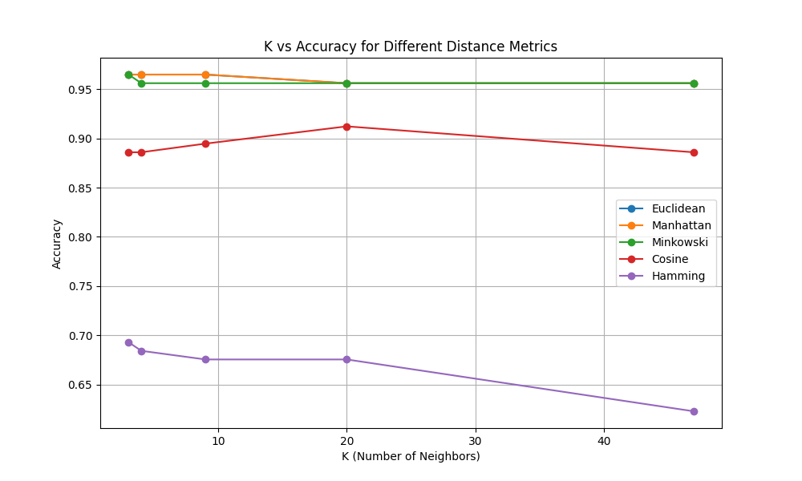
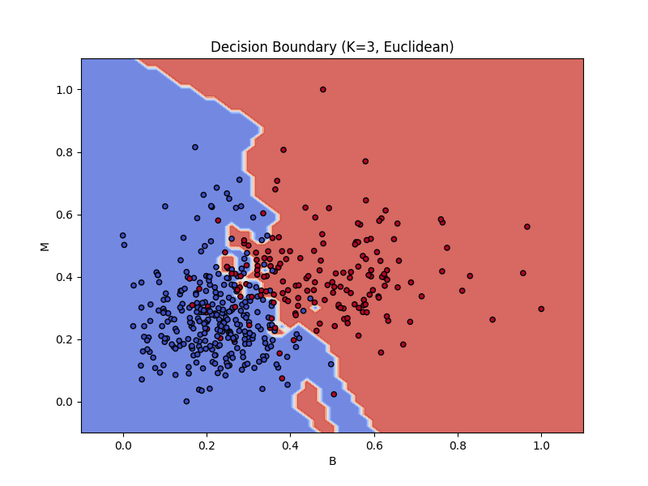
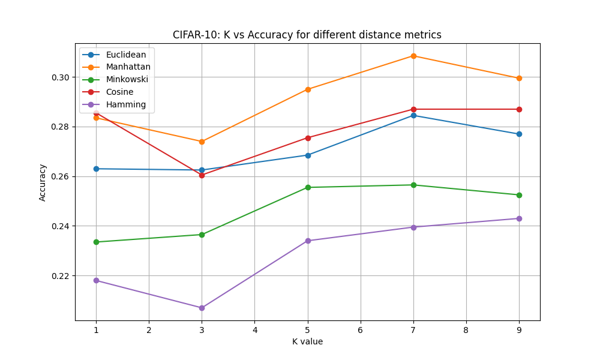

# Assignment 1: KNN Classification from Scratch  

**Date:** January 22, 2026  

---

## 1. Introduction  

This report details the implementation of a K-Nearest Neighbors (KNN) classifier from scratch to solve two distinct problems: binary classification of breast mass digitized images and multi-class classification using the CIFAR-10 image dataset. The project explores the impact of various distance metrics and different values of \( K \) on model accuracy.

---

## 2. Task 1: Binary Classification (Breast Cancer Diagnosis)  

### 2.1 Methodology  

A KNN classifier was implemented using a custom `UniformWeightedKNN` class. The dataset was split into **80% training** and **20% testing** sets. Features were normalized using **Min-Max Scaling** to ensure that distance calculations were not biased by different feature scales.

---

### 2.2 Mathematical Definitions of Distance Metrics  

Let **a** and **b** be two feature vectors of dimension \( n \):

- **Euclidean Distance (\(L_2\))**:  
  \[
  d(\mathbf{a}, \mathbf{b}) = \sqrt{\sum_{i=1}^{n} (a_i - b_i)^2}
  \]

- **Manhattan Distance (\(L_1\))**:  
  \[
  d(\mathbf{a}, \mathbf{b}) = \sum_{i=1}^{n} |a_i - b_i|
  \]

- **Minkowski Distance (\(p=3\))**:  
  \[
  d(\mathbf{a}, \mathbf{b}) = \left(\sum_{i=1}^{n} |a_i - b_i|^p\right)^{1/p}
  \]

- **Cosine Similarity (Distance)**:  
  \[
  d(\mathbf{a}, \mathbf{b}) = 1 - \frac{\mathbf{a} \cdot \mathbf{b}}{\|\mathbf{a}\| \|\mathbf{b}\|}
  \]

- **Hamming Distance**:  
  \[
  d(\mathbf{a}, \mathbf{b}) = \frac{1}{n} \sum_{i=1}^n \mathbb{I}(a_i \neq b_i)
  \]

---

### 2.3 Experimental Results  

The highest accuracy was achieved using **Manhattan** and **Euclidean** metrics at lower \(K\) values.

| Metric | K=3 | K=4 | K=9 | K=20 | K=47 |
| -------- | ------ | ------ | ------ | ------ | ------ |
| Euclidean/Minkowski | 0.9649 | 0.9561 | 0.9561 | 0.9561 | 0.9561 |
| Manhattan | 0.9649 | 0.9649 | 0.9649 | 0.9561 | 0.9561 |
| Cosine | 0.8860 | 0.8860 | 0.8947 | 0.9123 | 0.8860 |
| Hamming | 0.6930 | 0.6842 | 0.6754 | 0.6754 | 0.6228 |

**Best Configuration:**  

- \(K = 3\)  
- Distance Metric: **Euclidean**  
- Test Accuracy: **0.9649**  
- Precision: **0.9756** | Recall: **0.9302**

---

### 2.4 Visualizations  

  
**Figure:** K vs Accuracy for Task 1  

  
**Figure:** Decision Boundary (K=3, Euclidean)  

---

### 2.5 Inferences  

- **Metric Sensitivity:**  
  Euclidean and Manhattan distances performed exceptionally well after normalization. Hamming distance performed poorly because the dataset consists of continuous variables, and binarization leads to significant information loss.

- **Impact of K:**  
  Smaller \(K\) values (3, 4) captured local structure better. As \(K\) increased to 47, accuracy slightly decreased, indicating a move toward underfitting.

- **Decision Boundary:**  
  The visualization shows a clear separation between Benign (B) and Malignant (M) classes, though some overlap near the boundary suggests the need for non-linear separation.

---

## 3. Task 2: Multi-class Classification (CIFAR-10)  

### 3.1 Methodology  

The CIFAR-10 dataset was subsampled to **5,000 training** and **2,000 testing** images to optimize computation. Images were normalized to the range **[0, 1]**.

---

### 3.2 Experimental Results  

| Metric | K=1 | K=3 | K=5 | K=7 | K=9 |
| -------- | ------ | ------ | ------ | ------ | ------ |
| Manhattan | 0.2835 | 0.2740 | 0.2950 | **0.3085** | 0.2995 |
| Euclidean | 0.2630 | 0.2625 | 0.2685 | 0.2845 | 0.2770 |
| Cosine | 0.2855 | 0.2605 | 0.2755 | 0.2870 | 0.2870 |
| Minkowski | 0.2335 | 0.2365 | 0.2555 | 0.2565 | 0.2525 |
| Hamming | 0.2180 | 0.2070 | 0.2340 | 0.2395 | 0.2430 |

**Best Configuration:**  

- \(K = 7\)  
- Distance Metric: **Manhattan**  
- Test Accuracy: **0.3085**  
- Precision (Macro): **0.3801** | Recall (Macro): **0.3087**

---

### 3.3 Visualizations  

  
**Figure:** K vs Accuracy for CIFAR-10  

---

### 3.4 Inferences  

- **Metric Superiority:**  
  Manhattan distance performed better than Euclidean for image data, which is common in high-dimensional spaces.

- **Data Complexity:**  
  The lower accuracy (~30.8%) highlights that raw pixel values are not very discriminative for complex image classification without feature extraction techniques like CNNs.

- **Optimal K:**  
  \(K = 7\) provided the best balance between noise reduction and class discrimination.

---

## 4. Conclusion  

This assignment demonstrates that KNN is a strong baseline model but highly dependent on distance metrics and feature scaling. While it performs well on structured tabular data (Task 1), its limitations become clear on high-dimensional image data (Task 2), emphasizing the need for more advanced models like CNNs for image classification.
