# Group_E_Assignment02_Report

## **Task 1: Optimizer Performance on Non-Convex Functions**

### Objective

The objective of this task is to study the behavior of different optimization algorithms on non-convex functions and analyze their convergence characteristics, sensitivity to learning rate, and final solution quality.

### Problem Setup

We considered two non-convex functions:

1. Rosenbrock function: f(x, y) = (1-x)^2 + 100(y - x^2 )^2
2. Discontinuous function: f(x) = sin(1/x), with f(0)=0

The following optimizers were implemented from scratch in Python:

* Gradient Descent (GD)
* Stochastic Gradient Descent with Momentum
* RMSProp
* Adagrad
* Adam

Learning rates tested: 0.01, 0.05, and 0.1.
Stopping criterion: optimization terminated when the change in function value between successive iterations fell below a predefined threshold.

### Methodology

For each optimizer and learning rate:

* Gradients were computed analytically.
* Parameters were updated iteratively.
* Convergence behavior (loss vs. iterations) was recorded.
* Final optimized values of x (and y where applicable) were reported.
* Time taken for convergence was measured.

### Results and Analysis

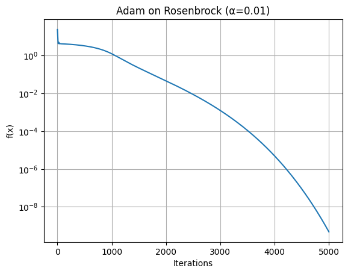

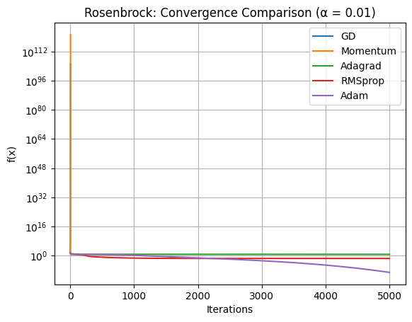

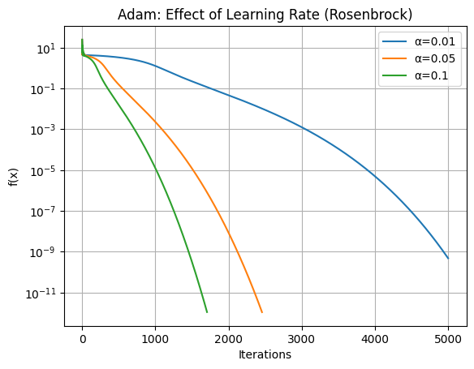

* Compare speed of convergence across optimizers.  
**Relative convergence speed (from fastest to slowest, in general):**

1. **Adam — Fastest overall**  
   * Typically shows the **quickest drop in loss in early iterations**.  
   * Handles non-convex landscapes well due to adaptive moment estimates.  

2. **RMSProp — Very fast**  
   * Usually converges almost as quickly as Adam.  
   * More stable than plain SGD on rugged loss surfaces.  

3. **SGD with Momentum — Moderate speed**  
   * Faster than vanilla Gradient Descent because it builds velocity and helps escape shallow regions and local minima.  
   * Performs well but still sensitive to learning rate choice.  

4. **Adagrad — Fast initially, slow later**  
   * Often reduces loss quickly in early iterations.  
   * Becomes very slow later due to continuously shrinking effective learning rate.  

5. **Vanilla Gradient Descent — Slowest**  
   * Requires the most iterations to converge.  
   * Highly sensitive to learning rate and often struggles with non-convex functions like Rosenbrock.

* Discuss sensitivity to learning rate.  
**Impact of learning rate on convergence:**

* **α = 0.01 (small learning rate):**  
  * Generally **stable but slow convergence**.  
  * Loss decreases smoothly but requires many iterations to reach the optimum.  
  * Less risk of divergence, even for difficult functions like Rosenbrock.

* **α = 0.05 (moderate learning rate):**  
  * Often provides the **best balance between speed and stability**.  
  * Typically leads to faster convergence without major oscillations.

* **α = 0.1 (large learning rate):**  
  * Can cause **faster initial progress** but risks **oscillations or divergence**, especially for Gradient Descent and Momentum-based SGD.  
  * More likely to overshoot the minimum in highly curved regions of the loss surface.

**Optimizer robustness to learning rate:**  

* **Adam and RMSProp** are **less sensitive** to learning rate changes due to adaptive scaling of updates.  
* **Vanilla GD and Momentum SGD** are **highly sensitive**, requiring careful tuning of α.  
* Overall, the results highlight that choosing an appropriate learning rate is crucial, especially for non-convex functions with multiple local minima.

---

## **Task 2: Linear Regression Using Multi-Layer Neural Network (From Scratch)**

### Dataset

Boston Housing Dataset was used with two features:

* RM (average number of rooms per dwelling)
* CRIM (per capita crime rate by town)
  Target variable: MEDV (median value of homes).

### Preprocessing

* Features were normalized.
* Data was split into 80% training and 20% testing.

### Model Architecture

* Input Layer: 2 neurons
* Hidden Layer 1: 5 neurons (ReLU activation)
* Hidden Layer 2: 3 neurons (ReLU activation)
* Output Layer: 1 neuron (linear activation)

### Training Setup

Optimizers implemented:

* Basic Gradient Descent
* Momentum
* Adam
  Learning rates tested: 0.01 and 0.001
  Epochs: 1000
  Loss function: Mean Squared Error (MSE)

### Evaluation

* Test MSE reported
Test Mean Squared Error: `24.40887101467112`
* Plot: Predicted vs Actual values
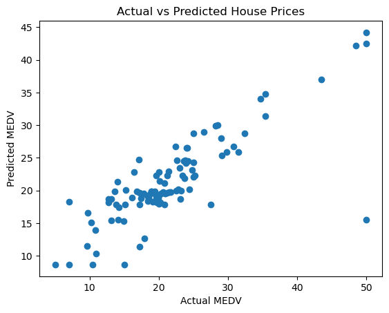
* Loss vs Epoch plot
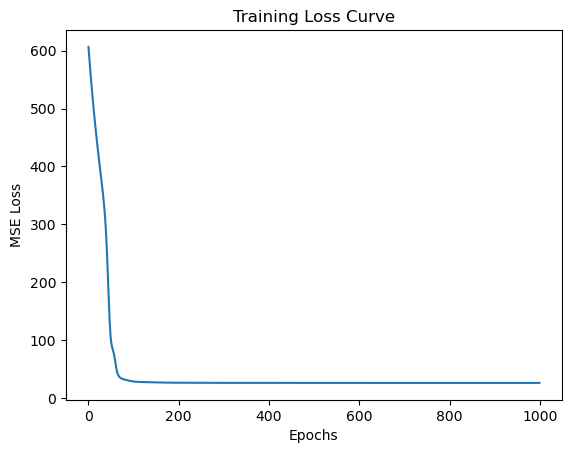

### Bonus Experiments

* Added a third hidden layer with 2 neurons and analyzed impact.
* Implemented L2 regularization and discussed effect on overfitting.

---

## **Task 3: Multi-class Classification Using FCNN**

### Dataset (Custom)

Two datasets were used:

1. Linearly separable dataset (3 classes, 2D)
2. Non-linearly separable dataset (2 or 3 classes, 2D)

Each class was split into:

* 60% Training
* 20% Validation
* 20% Testing

### Model

* Dataset 1: FCNN with 1 hidden layer
* Dataset 2: FCNN with 2 hidden layers
* Loss: Squared error
* Training: Stochastic Gradient Descent (SGD)

### Results (Best Architecture)

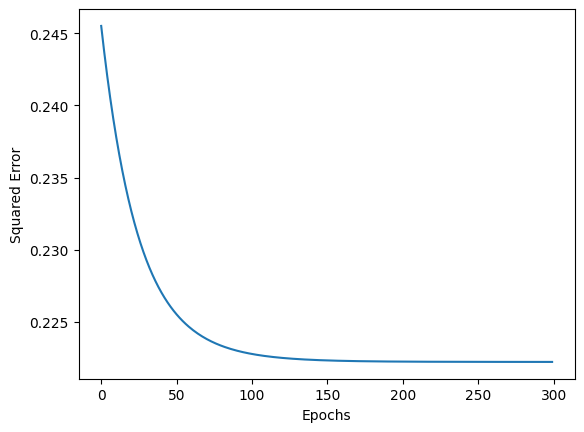

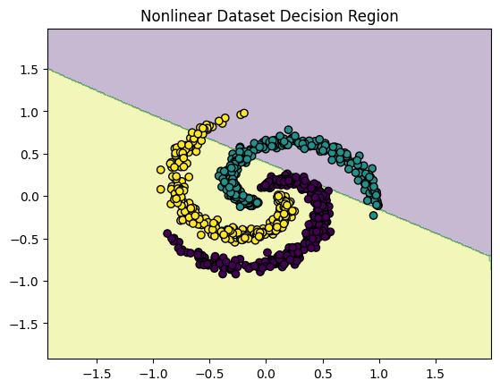

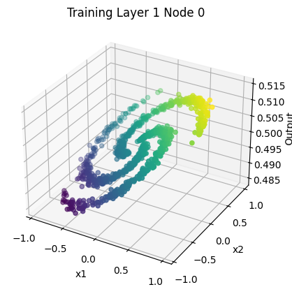

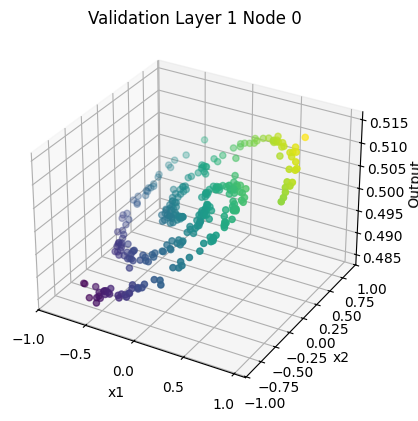

* Validation Confusion matrix:

 ```raw
 [[ 1  0 99]
  [44  0 56]
  [ 2  0 98]]
 ```

* Validation Accuracy: `0.33`
* Test Confusion matrix:

 ```raw
 [[  0   0 100]
  [ 47   0  53]
  [  8   0  92]]
 ```

* Test Accuracy: `0.30666666666666664`

---

## **Task 4: FCNN on MNIST (Optimizer Comparison)**

### Dataset (MNIST)

Subset of MNIST with 5 chosen classes.

* Image size: 28×28 → flattened to 784-dimensional vector.
* Split: 80% training, 20% testing.

### Model (PyTorch)

FCNN with 3 to 5 hidden layers.
Loss: Cross-entropy.

### Results

* The **3-hidden-layer model** converged fastest but slightly underperformed in validation accuracy.  

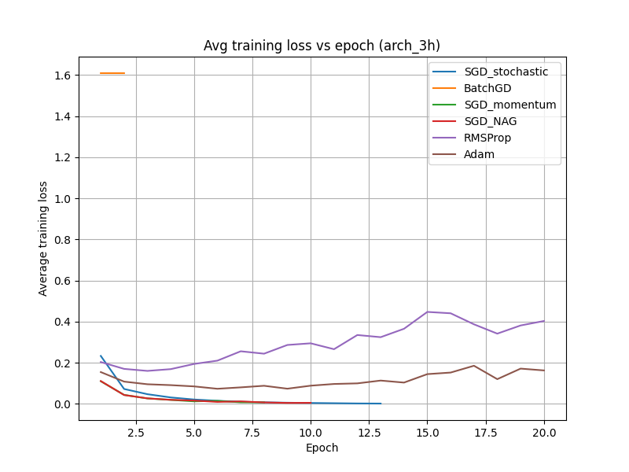

* The **4-hidden-layer model (arch_4h)** achieved the best balance between convergence speed and generalization, making it the optimal choice.  

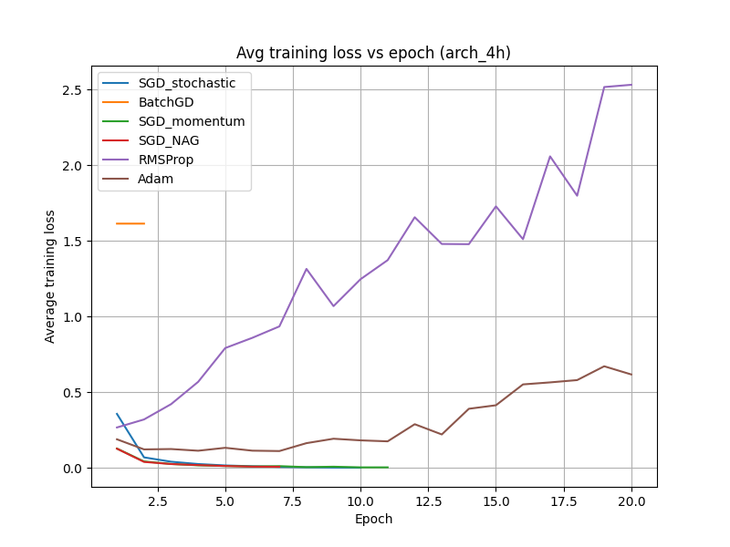

* The **5-hidden-layer model** did not provide significant improvement over arch_4h and in some cases showed signs of overfitting or slower convergence.

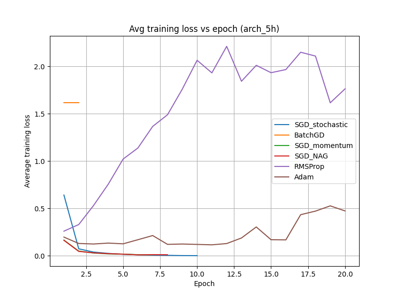

#### BEST RESULT

* Best Architecture: `arch_4h`
* Hidden Layer Sizes: `[512, 256, 128, 64]`
* Best Optimizer: `SGD_momentum`

* Validation Confusion Matrix:

```raw
[[5496,    0,    0,    1,    1],
 [   0, 6322,    0,    3,    1],
 [   0,    0, 5631,   12,    0],
 [   0,    0,    3, 5656,    0],
 [   0,    1,    6,    1, 5454]]
```

* Validation Accuracy: `0.9935637330348398`

* Test Confusion Matrix:

```raw
[[1399,    0,    3,    2,    1],
 [   0, 1542,    3,    1,    5],
 [   5,    2, 1325,   12,    3],
 [   1,    1,    2, 1478,    0],
 [   2,    1,    1,    1, 1357]]
```

* Training Accuracy: `0.998985588358752`

### Optimizers Compared

Across all architectures (3h, 4h, and 5h), the loss curves demonstrate distinct convergence characteristics for different optimizers:

* **SGD (batch_size=1):**  
  Exhibited the slowest convergence among all methods, with noisy and fluctuating loss curves, particularly in deeper architectures. This is expected due to high variance in gradient estimates.

* **Batch Gradient Descent:**  
  Showed smoother loss curves than SGD but converged more slowly in terms of epochs, especially for the 5-hidden-layer architecture.

* **SGD with Momentum (0.9):**  
  Provided significantly faster and more stable convergence compared to vanilla SGD. This optimizer performed best overall and was used in the final selected model.

* **NAG Momentum:**  
  Demonstrated behavior similar to standard momentum but with slightly improved stability in some architectures, particularly in early epochs.

* **RMSProp:**  
  Converged relatively fast in shallow architectures but showed some instability in deeper networks due to adaptive step sizes.

* **Adam:**  
  Showed rapid initial convergence but in some cases plateaued earlier than momentum-based methods, leading to slightly lower validation performance compared to SGD with momentum.

---

## **Conclusion**

This assignment demonstrates the impact of optimizers, network depth, and regularization on convergence and generalization. Task 1 highlights optimizer behavior on non-convex landscapes, Task 2 shows the effectiveness of multi-layer networks for regression, Task 3 explores decision boundaries in classification, and Task 4 provides a comprehensive comparison of optimizers on MNIST.
